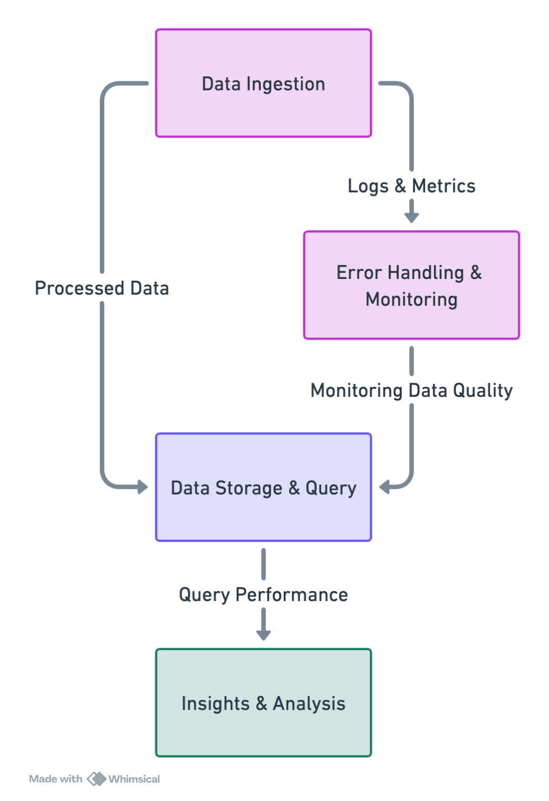

# AdvertiseX Data Engineering Project

## Overview

This repository contains all the components for AdvertiseX ad engineering
The 3  main components: Data Ingestion, Data Storage & Query, and Error Handling & Monitoring. Each of the components have their own directories and explains in details how they should be implemented and also contains architecture diagrams.

## Project Components

### Data Ingestion

Handles the collection and initial processing of data from various sources, including ad impressions, clicks, conversions, and bid requests. It supports both real-time and batch data processing, utilizing technologies like Apache Kafka and AWS Glue.

### Data Storage & Query

Focuses on storing processed data efficiently and optimizing the storage system for fast querying and aggregations of ad campaign data. It leverages distributed columnar storage solutions and data warehouses like Amazon Redshift or Google BigQuery for analytical queries.

### Error Handling & Monitoring

Ensures the operational health of the system by detecting data anomalies, discrepancies, or delays. It uses AWS services like CloudWatch, Lambda, SNS, and SQS to monitor, alert, and resolve issues, maintaining the effectiveness of ad campaigns.

## Architecture

The project's architecture integrates these components to provide a comprehensive solution for data engineering challenges in the digital advertising domain.

## Getting Started

Detailed documentation and sample code is provided in each individual component's directory

## Assumptions 

Assuming the environment to be hosted is on AWS . Some component for example in Data  storage and query also provides alternate GCP solution like using bigquery.
