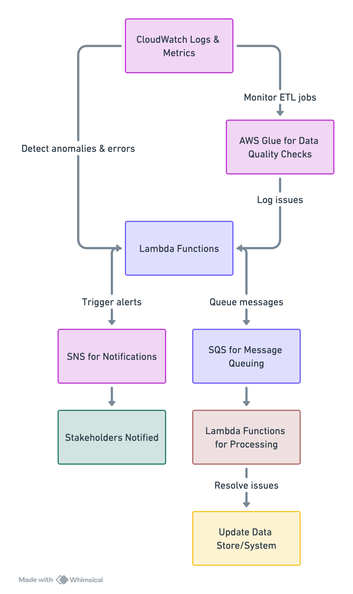

# Data Logger and Metrics System

## Overview

The Data Logger and Metrics System is designed to ensure the operational health and reliability of the AdvertiseX digital advertising platform. It focuses on monitoring, error handling, and alerting mechanisms to detect and address data anomalies, discrepancies, or delays promptly.

## Architecture

The system leverages several AWS services to create a robust monitoring and error handling framework:

- **AWS CloudWatch**: Used for logging and monitoring metrics from various AWS services and applications. It detects anomalies and errors in real-time.
- **AWS Lambda**: Executes custom logic for error processing and anomaly detection. It can trigger alerts or process error messages based on the nature of the detected issues.
- **Amazon SNS (Simple Notification Service)**: Facilitates the sending of notifications to alert stakeholders about detected issues, ensuring quick response times.
- **Amazon SQS (Simple Queue Service)**: Manages message queues for error messages and informational logs, allowing for asynchronous processing and decoupling of system components.
- **AWS Glue**: Performs data quality checks during ETL jobs, logging any issues detected for further action.

## Components

### Notification Strategy

Outlines the approach for notifying system administrators and developers about errors, warnings, and informational messages. Utilizes Amazon SNS for immediate notifications and email for detailed reports and summaries.

### Message Queue Strategy

Defines the use of Amazon SQS for managing error messages and informational logs. Focuses on load balancing, error handling, and decoupling of processing tasks.

### Error Handling Strategy

Describes the process for detecting, logging, and resolving errors within the data processing pipelines. Emphasizes the use of AWS CloudWatch for detection and logging, AWS Lambda for processing, and Amazon SNS for alerting stakeholders.

## Getting Started

To implement and customize the Data Logger and Metrics System for your needs, review the detailed strategies provided in the `docs` directory and the sample code in the `lambda-functions` directory. Adjust the notification, message queue, and error handling strategies according to your project requirements and operational best practices.

