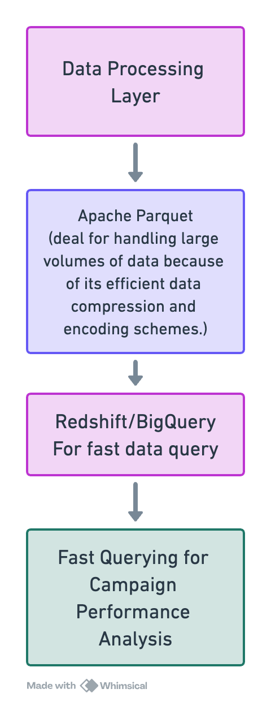

# Data Storage and Query Component

## Overview

This component  focuses on  efficient storage and fast querying of processed advertising data. It is designed to handle large volumes of data generated by ad impressions, clicks, conversions, and more, enabling insightful analysis of campaign performance.

## Structure

The `data-storage-and-query` directory is organized into several subdirectories, each serving a specific purpose in the data storage and querying process:

- **parquet-files/**: Contains Apache Parquet files that store processed data in a columnar format, optimized for analytical queries.
- **warehouse-loaders/**: Includes scripts for loading data into data warehouse solutions like Amazon Redshift and Google BigQuery.
- **query-optimization/**: Contains strategies and practices for optimizing query performance, including partitioning, indexing, and caching.

### Warehouse Loaders

Presenting both solutions for AWS and GCP . resshift and bigquery both works well for this specific use case

- `redshift-loader.py`: Script to load data from Apache Parquet files into Amazon Redshift.
- `bigquery-loader.py`: Script to load data into Google BigQuery.

### Query Optimization Strategies

- **Partitioning**: Partition the data by date value or campaign IDs
- **Indexing**: we can use secondary indexes on columns that are frequently used in WHERE clauses or  join keys. 
- **Caching**: Caching in queries where the data processing time is high

